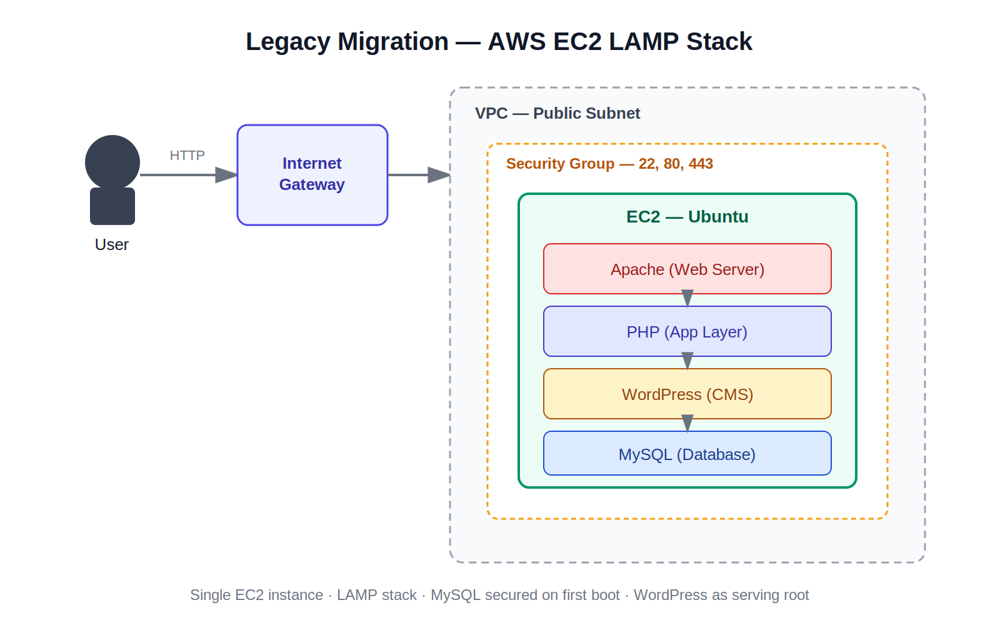
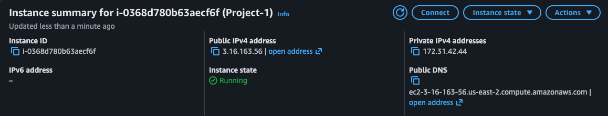
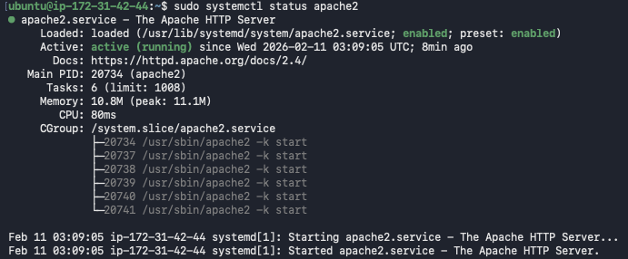
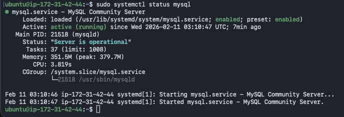
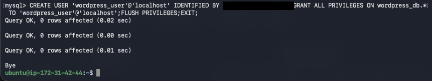
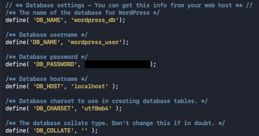
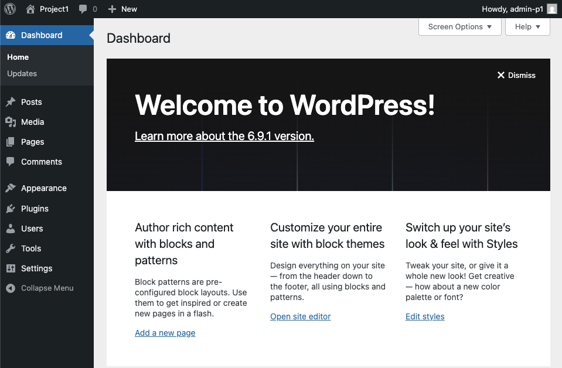

# Legacy System Migration to AWS — LAMP Stack + WordPress

## Overview

This project migrates a legacy application from an on-premises/outdated environment to AWS, replacing it with a modern, self-managed LAMP (Linux, Apache, MySQL, PHP) stack running WordPress on a single EC2 instance. The result is a system that's easier to manage, more secure by default, and positioned to scale as traffic grows.

**Scope:** provisioning compute, installing and hardening the web/database services, and deploying WordPress as the CMS layer.

## Architecture



**Traffic flow:** client requests hit the EC2 instance over HTTP/HTTPS (restricted by security group to ports 22, 80, 443) → Apache serves the request → PHP executes WordPress application logic → MySQL handles persistent data. Administrative access is separated via SSH key-pair authentication.

| Layer | Component | Purpose |
|---|---|---|
| Compute | AWS EC2 (Ubuntu) | Hosts the entire stack |
| Web Server | Apache2 | Serves HTTP requests, routes to PHP |
| Runtime | PHP + libapache2-mod-php, php-mysql | Executes WordPress application code |
| Database | MySQL Server | Stores WordPress content and configuration |
| CMS | WordPress | Content management / front-end |
| Access Control | Security Group + SSH key pair | Restricts inbound traffic, secures admin access |

## Prerequisites

- AWS account with permissions to launch EC2 instances
- A key pair (`.pem`) for SSH access
- Security group allowing inbound 22 (SSH), 80 (HTTP), 443 (HTTPS)

## Implementation

### 1. Provision and connect
```bash
ssh -i "your-key.pem" ubuntu@ec2-xx-xx-xx-xx.compute.amazonaws.com
```

### 2. Update the system
```bash
sudo apt update && sudo apt upgrade -y
```

### 3. Install the LAMP stack
```bash
sudo apt install apache2 -y
sudo apt install php libapache2-mod-php php-mysql -y
sudo apt install mysql-server -y
```

### 4. Start and enable services
```bash
sudo systemctl start apache2 mysql
sudo systemctl enable apache2 mysql
sudo systemctl status apache2 mysql
```

### 5. Harden MySQL
```bash
sudo mysql_secure_installation
```

### 6. Deploy WordPress
```bash
wget https://wordpress.org/latest.tar.gz
tar -xvzf latest.tar.gz
sudo mv wordpress/* /var/www/html/
sudo chown -R www-data:www-data /var/www/html/
sudo chmod -R 755 /var/www/html/
```

### 7. Create the WordPress database and scoped user
```sql
CREATE DATABASE wordpress_db;
CREATE USER 'wordpress_user'@'localhost' IDENTIFIED BY 'your_password';
GRANT ALL PRIVILEGES ON wordpress_db.* TO 'wordpress_user'@'localhost';
FLUSH PRIVILEGES;
```

### 8. Configure WordPress
```bash
sudo mv /var/www/html/wp-config-sample.php /var/www/html/wp-config.php
sudo nano /var/www/html/wp-config.php
```
Update the database credentials:
```php
define('DB_NAME', 'wordpress_db');
define('DB_USER', 'wordpress_user');
define('DB_PASSWORD', 'your_password');
```

### 9. Go live
```bash
sudo systemctl restart apache2
sudo rm /var/www/html/index.html
```
Navigate to the instance's public IP to complete WordPress setup.

## Security Considerations

- Database credentials are scoped to a dedicated MySQL user rather than root, limiting blast radius.
- Inbound access is restricted at the security group level — SSH is key-pair only, no password auth.
- `mysql_secure_installation` removes default accounts/test databases before the instance handles production data.
- File ownership is set to `www-data:www-data` with `755` permissions — write access stays scoped to what Apache needs, not broader than necessary.

## Verification

| | |
|---|---|
| **EC2 Instance Console** — instance type, security group rules, public IP |  |
| **Apache Status** — service active and running |  |
| **MySQL Status** — service active and running |  |
| **MySQL User Grants** — `wordpress_user` scoped correctly to `wordpress_db` |  |
| **wp-config.php** — database connection configured (credentials redacted) |  |
| **Live WordPress Site** — deployment confirmed end to end |  |

## Repository Structure

```
.
├── README.md
└── images/
    ├── architectural-diagram.png
    ├── 01-ec2-instance-console.png
    ├── 02a-apache-status.png
    ├── 02b-mysql-status.png
    ├── 03-mysql-user-grants.png
    ├── 04-wp-config-redacted.png
    └── 05-live-wordpress-site.png
```
